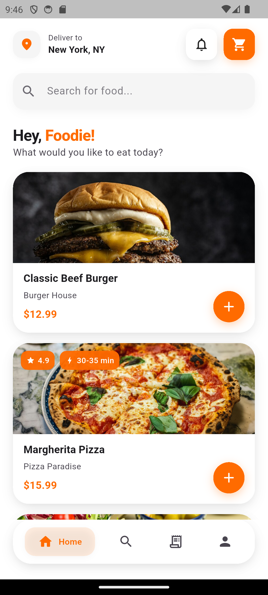

# Foodie — Food Delivery App

A modern, mobile-first food delivery app UI built with **Flutter** and **Material 3**. Clean orange-and-white design with neumorphic cards, smooth animations, and a polished in-app experience.

---

## Description

**Foodie** is a food delivery application that lets users browse restaurant dishes, see ratings and delivery times, and add items to cart. The interface is built for clarity and ease of use: a clear header with location and cart, a search bar, a personalized greeting, and a scrollable list of food cards. Each card shows an image, name, restaurant, price, and optional rating and delivery-time badges, with an add-to-cart button that gives immediate feedback.

The app uses a consistent **orange (#FF6B00) and white** palette, **neumorphism-style** shadows and surfaces, and **Material 3** components and theming. Animations include staggered fade-in for the food list, a bounce effect on the add-to-cart button, and an animated bottom navigation bar for Home, Search, Orders, and Profile.

---

## Features

- **Home screen** — Location (e.g. “Deliver to New York, NY”), notifications and cart in the header; search bar; greeting (“Hey, Foodie!”); scrollable list of food items.
- **Food cards** — Neumorphic cards with soft shadows, food image from assets, title, restaurant, price, and optional rating/delivery badges; circular orange add-to-cart button with bounce animation.
- **Staggered list animation** — Food cards fade in and slide up with a short delay per item.
- **Animated bottom navigation** — Home, Search, Orders, Profile with smooth transition and highlight for the active tab.
- **Cart feedback** — Add-to-cart updates a badge on the header cart icon and shows a floating SnackBar.
- **Asset-based images** — Food images loaded from `assets/images/` (e.g. `classic_beef_burger.png`, `margherita_pizza.png`). See `assets/images/README.md` for naming.

---

## Screenshots

| Home screen |
|-------------|
|  |


---

## Getting Started

### Prerequisites

- [Flutter SDK](https://docs.flutter.dev/get-started/install) (stable channel)
- Android Studio / Xcode or another supported IDE
- Device or emulator

### Run the app

```bash
# Clone or open the project, then:
cd food_delivery_app

# Get dependencies
flutter pub get

# Run on connected device or emulator
flutter run
```

### Food images

Place food images in `assets/images/` with **lowercase names and underscores** (no spaces), for example:

- `classic_beef_burger.png`
- `margherita_pizza.png`
- `caesar_salad.png`
- `spicy_chicken_wings.png`
- `chocolate_brownie.png`

See `assets/images/README.md` for the full list. Missing images are replaced by a gradient placeholder.

---

## Project Structure

```
lib/
├── main.dart                 # App entry, theme, main shell & bottom nav
├── app_theme.dart            # Material 3 theme, colors, neumorphic shadows
├── models/
│   └── food_item.dart        # Food item model & sample list
├── screens/
│   └── home_screen.dart      # Home: header, search, greeting, food list
└── widgets/
    ├── food_card.dart        # Neumorphic food card, image, badges, add-to-cart
    ├── neumorphic_container.dart
    └── animated_bottom_nav.dart

assets/
└── images/                   # Food images (see assets/images/README.md)

screenshot/                   # App screenshots for README
```

---

## Tech Stack

- **Flutter** (Dart)
- **Material 3** (useMaterial3, ColorScheme, typography)
- **Cupertino Icons** (optional)
- No backend; UI and local state only

---

## License

This project is provided as-is for learning and portfolio use.
